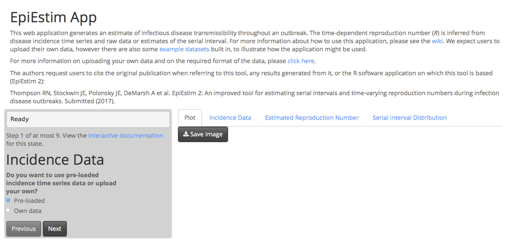
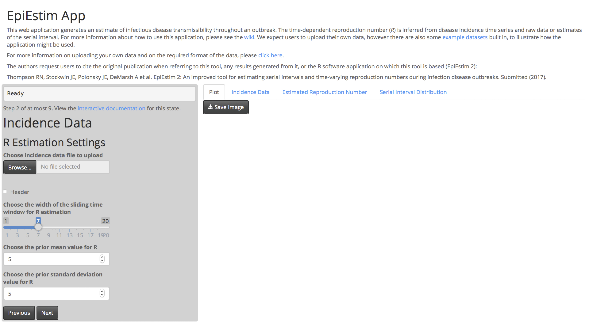
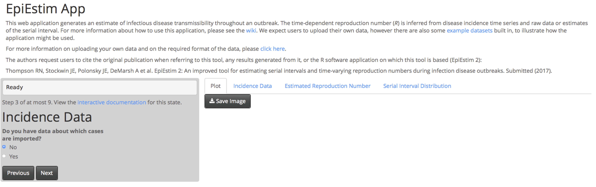
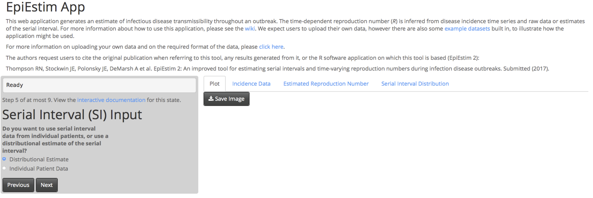
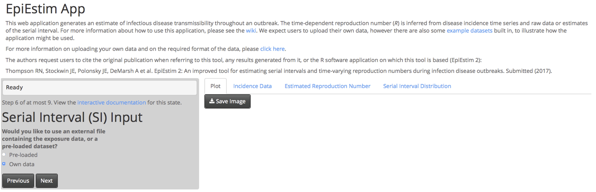
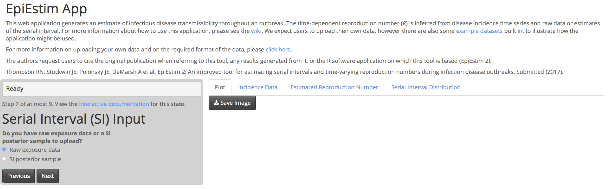
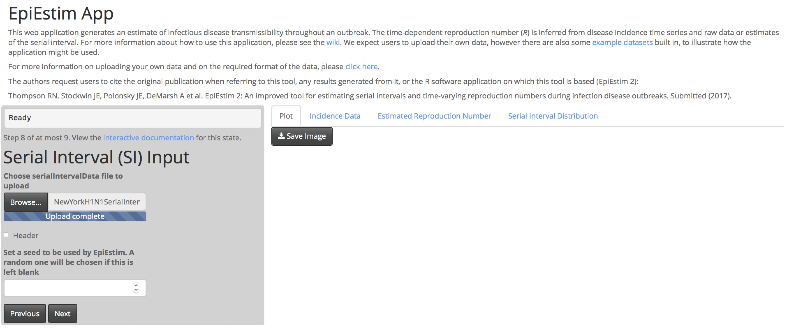
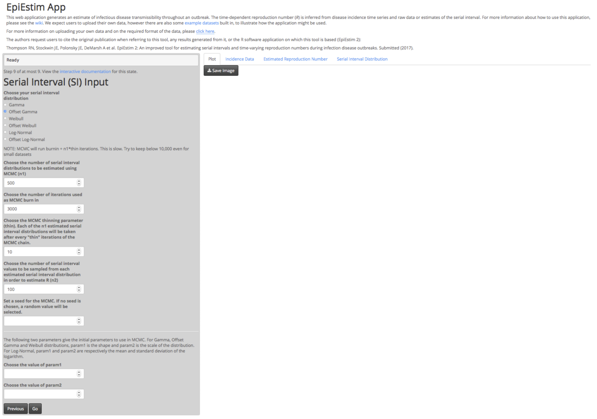
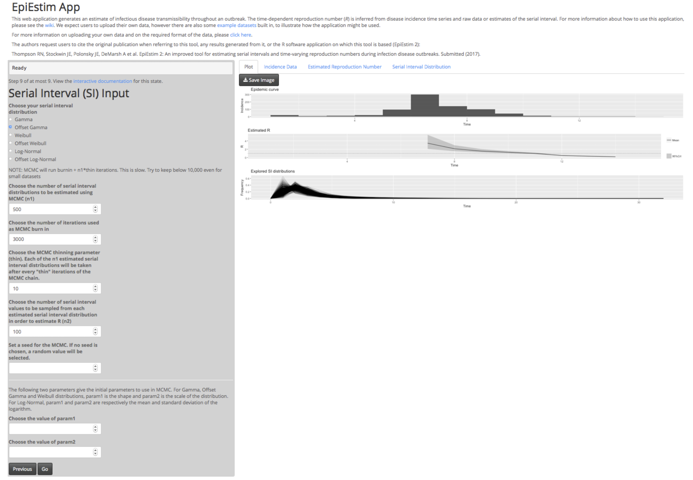

```{r setup, include = FALSE}
knitr::opts_chunk$set(
  collapse = TRUE,
  comment = "#>"
)
```

## Introduction

EpiEstimApp is a user-friendly software interface that makes EpiEstim available to users unfamiliar with R statistical software. Here we demonstrate how the interface can be launched and then used to estimate the time-dependent reproduction number using a sample dataset.  For a guide describing usage of EpiEstimApp with data in forms different to these sample data, see the online wiki (https://github.com/jstockwin/EpiEstimApp/wiki).

## Loading EpiEstimApp

To load the app, the easiest way is to open a web browser and simply navigate to the online interface.  If you choose this approach, type in the web address below and skip to “Loading the data” below.

    www.XXX.XXX

Alternatively, to load EpiEstimApp in R, first install devtools if you have not already done so, install EpiEstimApp, and launch EpiEstimApp.

    install.packages("devtools")
    devtools::install_github("jstockwin/EpiEstimApp")
    EpiEstimApp::runEpiEstimApp()

If the app is not now open in your web browser, look for "Listening on http://127.0.0.1:xxxx" in your R console and open that page.

```{r, out.width = "800px"}

```


## Loading the data and estimating the reproduction number

The example that follows will use disease incidence time series (DataS1.csv) and interval-censored observations of the serial interval (DataS2.csv), which are datasets available at XXX. Save these on your computer.

Since we will be uploading the first of these files as the incidence data, select "Own data" and click "Next".

```{r, out.width = "800px"}

```

Click browse, and choose the incidence file XXX.csv from your computer to upload. Now select the length of the sliding time window W over which EpiEstim will estimate the time-dependent reproduction number. Here we choose W = 6. In this case the reproduction number will then be estimated over windows [1,7], [2,8],...  Also choose the gamma distributed prior parameter values for the reproduction number, and then click "Next".

```{r, out.width = "800px"}

```

Since the incidence dataset that we are considering here does not contain information about cases imported from elsewhere, click "No" and then "Next".

```{r, out.width = "800px"}

```

We are going to upload interval censored patient data on the serial interval, so click "Individual Patient Data" and "Next".

```{r, out.width = "800px"}

```

Since we want to upload our own dataset, click "Own data" followed by "Next".

```{r, out.width = "800px"}

```

We will be uploading raw patient data and using these data to generate a posterior, so click "Raw exposure data" followed by "Next".

```{r, out.width = "800px"}

```
Now click browse, and select the serial interval data file XXX.csv from your computer.  If desired, choose a number to seed the reproduction number estimation so that the results are reproducible. Click "Next".

```{r, out.width = "800px"}

```

Finally, choose the distribution to fit to the serial interval data, and if desired also change the other parameters associated with the fitting.  We will choose an "Offset Gamma" distribution, and use all other parameter values set to default.  Click "go", and wait for the results!

```{r, out.width = "800px"}

```

We have now obtained an estimate of the reproduction number throughout the outbreak of H1N1 infuenza in a New York school.
